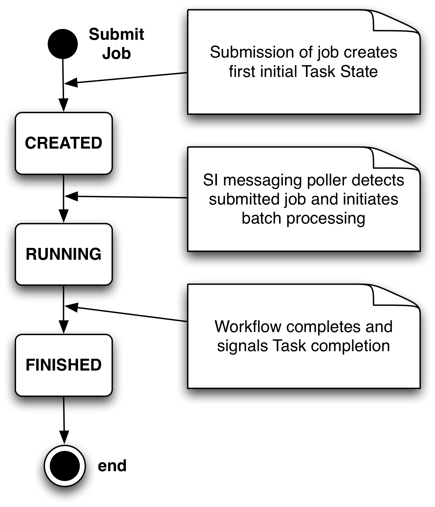
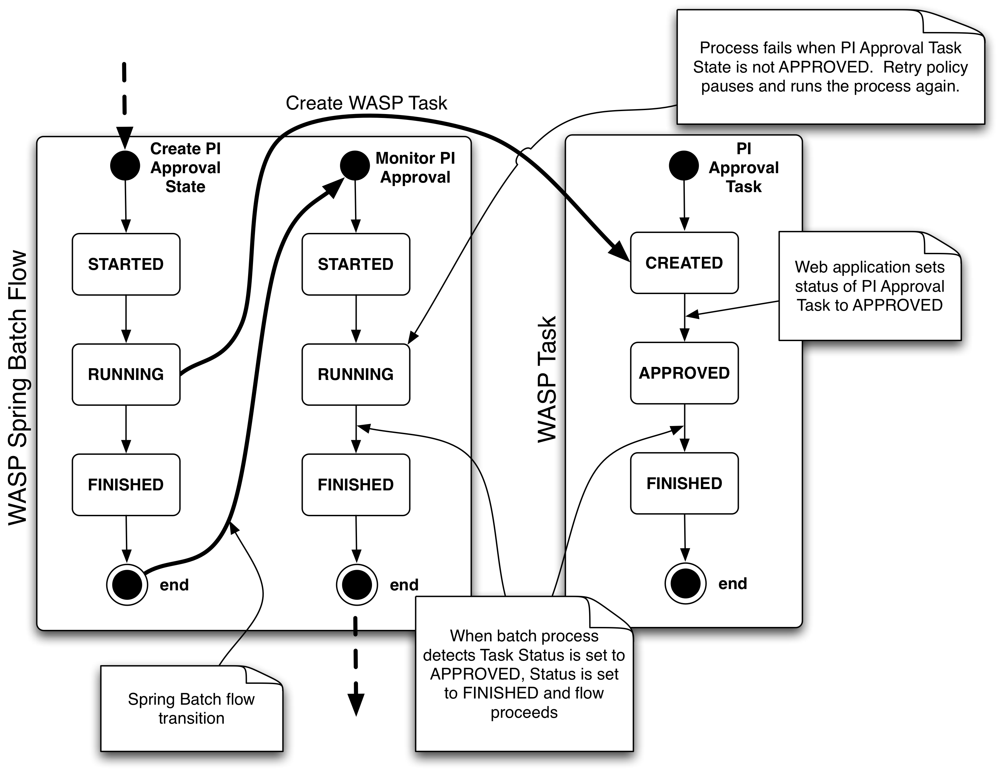

******************
Core concepts
******************
	
Concepts and procedures for working with WASP.

================
Data Model
================
		
The WASP data model is managed with the object-relational mapping tool `Hibernate <http://hibernate.org/>`_.
Model classes are defined in the package ``edu.yu.einstein.wasp.model``
of the `wasp-core` module. Consult the `JavaDoc <http://waspsystem.org/dev/site/apidocs/index.html>`_ for 
detailed information regarding the WASP data model.
		
==========
State
==========
		
State is a central concept to dealing with data processing in WASP. 
State is managed by a split mechanism within WASP.  The first is a state semaphore system
that is handled through persistence using the WASP `State` class.  WASP developers
define `Task`\s that represent human intervention tasks that are managed by
`State`\s. A depiction of state transition for the overall Job task is presented
in :num:`figure #fig-jobtaskstate`.  In this example, upon creation of a WASP Job, a corresponding
`Task` is created in the database and it is assigned a `State` value indicating
that the process is running (running of the process is managed by Spring Batch). 
The processing pipeline proceeds through its steps and changes the `State` to completed 
after completion of work. WASP task states are defined by the `TaskStatus` `enum`.
The intention is to use these states for all tasks; however, states are persisted through `Enum`\s
allowing developers can create their own states to manage custom `Task`\s 
when it becomes necessary.  

.. _fig-jobtaskstate:

   Job Task State.

  
All processes defined within WASP are implemented as `Spring Batch <http://www.springsource.org/spring-batch">`_ job flows.  :num:`figure #fig-taskstate` presents an
example state diagram where the state of a Spring Batch flow is determined by the `State` of
a WASP `Task` designed to manage human interaction related to the flow.  

.. _fig-taskstate:
		

		
   State transitions for a WASP task to monitor approval of a job by a principal investigator.
		
Standard Spring Batch flows are distributed with the system as plugins, and define the standard behavior 
of the application.  These flows can be configured for a local instance or even completely replaced.  Any
logic that is particular to a particular institution can be configured by adding custom flow steps.  For example,
the standard web application defines the act of manually approving an invistigator's request by a departmental 
administrator who checks to see that the investigator has sufficient funds in the grant used to place an order.
This step can be removed and replaced with code that requests funds from an institutional accounting system,
encumbers the funds, and automatically approves the job.  This new functionality may then be overridden in
the web application where tasks can be approved by users with sufficient privileges.
	
=====================
Web functionality
=====================

Description of XML definitions of web flows and implementation of custom 
controllers.  How to extend.
		
====================
Metadata system
====================
		
Description of the WASP key-value data collection system, enforcement via
code and how to extend it.  How to define resources and collect metadata.

====================
Analytical Pipelines
====================
Execution of analytical pipelines: trigger instrument specific pipelines (eg. 
Illumina/CASAVA), encapsulate existing tools as tasks (eg. MPS reference based aligners)
or define flows of tasks to generate analytical pipelines.
