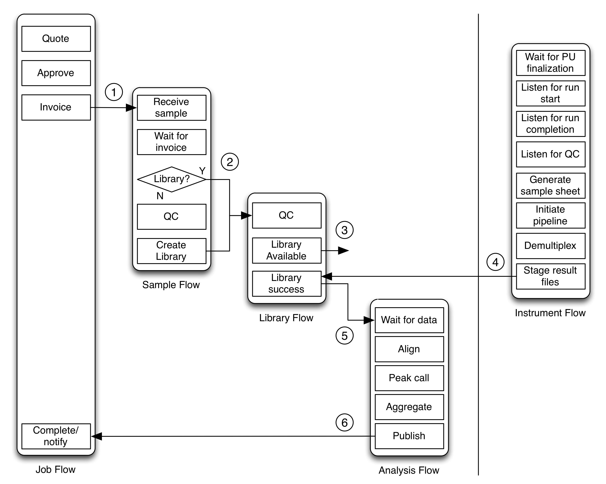

********************************
Developing Wasp System Pipelines
********************************
	
WASP is designed to be flexible in that data processing flows can incorporate steps from other flows,
providing sequencing facilities to tune processing and analysis to their liking and actual environment.  The
standard processing flows are distributed as a guideline; however they may be modified as necessary to meet
individual needs.

=====================================
Overview of a standard ChIP-seq flow
=====================================
		
The basic design of a massively parallel sequencing flow is presented in :num:`figure #fig-sequencingflow`. 

.. _fig-sequencingflow:

   Overview of hierarchy of flows to complete a MPS analysis

Sample handling and analysis flows are configured and initiated by the web application upon successful
submission of a sequencing job.  Flows operate independently and are configured to wait at certain stages until 
they are messaged by other flows. The job flow sends a message that an invoice has been generated (1), which is
received by the sample flow.  Independent sample flows for each sample, message their associated library flows (2),
upon completion of library preparation.  When libraries are ready for sequencing, the library flow messages
the library's completion (3), and marks them as such in the database.  When the sequencing facility begins an
instrument flow, the completed libraries are presented to the operator who assigns them to platform units 
and the flow tracks the sequencing of the libraries.  When result files have been generated, the instrument 
flow messages completion (4), the library flow completes (5), and the analysis flow processes the data and 
signals final completion (6).

Messages are status messages that do not have a particular destination.  Any component can be configured
to listen to and react to a particular message.  Messages also contain specific information about the status
of the step, e.g. step completion or failure. 
