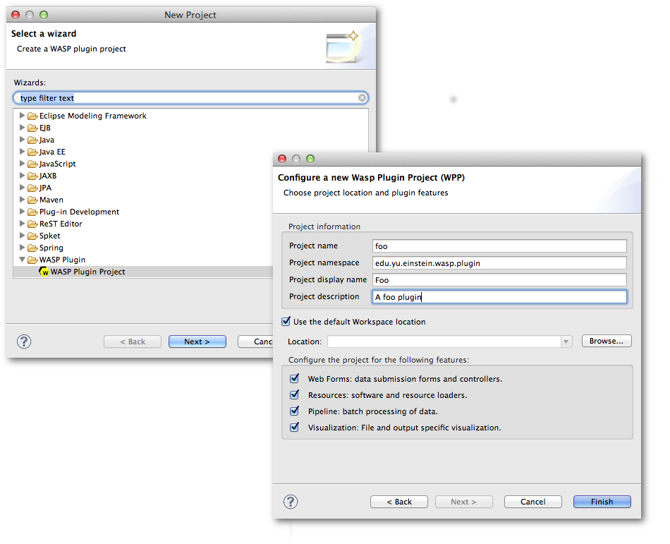

Creating a Plugin for Wasp
##########################

Wasp Plugins are extensions of the Wasp System (WS) Core code which enable users to add new features to a local instance of the WS or for open-source 
distribution. Plugins can provide a variety of functionalities, common examples being:

* New assays: Sample submission form definitions and flow, analysis workflows.
* Software: definition, dependencies and workflows
* Visualization tools: Generation of panels

Installing and Using the Wasp System Eclipse Plugin
***************************************************

In order to create a plugin for the Wasp System you first need to install the Wasp System Eclipse Plugin (WSEP) for the STS from the WSEP 
update site (http://waspsystem.org/eclipse):

1) From the STS menu choose *Help* -> *Install New Software* then in the dialog select *Add*.

2) Fill in the text boxes: *Name:* "Wasp System Update Site", *Location:* "http://waspsystem.org/eclipse". Click *OK*.

3) In the *Work with* section of the *Install* dialog, select *Wasp System Update Site*, press the *Select All* button then *Next* -> *Next*.

4) Agree to the license agreement and click *Finish*. You will see a security warning about installing unsigned content. This is nothing to worry about, 
   simply click *OK* to proceed.

5) When prompted, click the button to restart Eclipse.

Creating a New Wasp System Plugin Project
*****************************************

From the STS menu bar select *File* -> *New* -> *Project* -> *WASP Plugin* -> *WASP Plugin Project* and click *Next*. Fill in the Project information 
as requested and configure the project by selecting the desire features (:num:`figure #fig-configureProj`):

.. _fig-configureProj:
 

   
   Configuration of a new wasp plugin.

* **Web forms:**
  Sets up the project to aid with producing a plugin that is web-enabled. Provides a folder structure, configuration files and classes necessary to interact
  with the *wasp-web* application. Check this option if providing a resource such as a DNA sequencer, an assay workflow, or software for primary analysis 
  where user parameter selection / configuration is possible.
	
* **Resource:**
  Checking this option adds files and folders that help with developing a plugin that provides a resource (particularly software).
	
* **Pipeline:**
  This option should be checked if the plugin is going to provide one or more Spring Batch Workflows. It ensures inclusion of necessary configuration files
  and a suitable folder structure.
	
* **Visualization:**
  If a plugin is designed to provide visualizations, e.g. present plots of data or a table of information, ensure that this item is checked.
	

After configuring the project click *finish* and the project will be built and appear in the *Package Explorer* on the left-hand side of the Eclipse IDE 
(:num:`figure #fig-picardProjStructure`).

.. _fig-picardProjStructure

.. figure:: figures/picardProjStructure.png
   :width: 10cm
   :align: center
   
   Example project folder structure (all configuration options checked).

Lets look at the structure and examine the various components.

* **src/main/java**

  - **{package_root}.batch.tasklet** 
    Location for batch job tasklets. Tasklets contain the code executed in each step of the batch flow. They extend abstract class 
    *wasp-daemon:edu.yu.einstein.wasp.daemon.batch.tasklets.WaspTasklet*
    
  - **{package_root}.batch.controller**
    MVC controller code. For web-enabled plugins the request mappings and associated business logic are defined here. Classes should extend the 
    *wasp-web:edu.yu.einstein.wasp.controller/WaspController* class.
    
  - **{package_root}.exception**
    Package for placing plugin-specific exceptions. An extension of Exception and RuntimeException are provided and can be extended further.
    
  - **{package_root}.integration.endpoints**
    This package is where custom Spring Integration message endpoint classes can be defined. These include service activators, channel adapters, transformers, 
    filters, routers, splitters and aggregators. See the SpringSource documentation (http://static.springsource.org/spring-integration/reference) for more 
    information message endpoints.
  
  - **{package_root}.integration.messages**
    Spring Integration provides for messages and message channels to be defined that allow communication between the core wasp systems and plugins. Messages 
    are simply a set of 
    headers (key-value) and a payload object. The name and value of headers and the type and value of the payload can all be used to determine how a message 
    is routed, filtered and acted upon. As the specification is so loose, the Wasp System uses wrappers around the messages to allow standardization. This
    package may contain message template classes that extend the *wasp-core:edu.yu.einstein.wasp.integration.messages.templates.WaspMessageTemplate* and 
    *wasp-core:edu.yu.einstein.wasp.integration.messages.templates.WaspStatusMessageTemplate* classes. Extensions of the 
    *wasp-core:edu.yu.einstein.wasp.integration.messages.WaspMessageType* and *WaspStatus* classes may also be provided here. The base classes for 
    *WaspMessageType* and *WaspStatus* are shown below.
    
    .. code-block:: java
    
	    public class WaspMessageType {
			public static final String HEADER_KEY = "messagetype"; // constant for use with message headers
			public static final String JOB = "job"; 
			public static final String PLUGIN = "plugin";
			public static final String RUN = "run";
			public static final String SAMPLE = "sample";
			public static final String LIBRARY = "library";
			public static final String ANALYSIS = "analysis";
			public static final String GENERIC = "generic";
			public static final String FILE = "file";
			public static final String LAUNCH_BATCH_JOB = "launchBatchJob";
		}
		
		public class WaspJobParameters {
			public static final String GENOME_STRING = "genomeString";
			public static final String JOB_ID = "jobId";
			public static final String JOB_NAME = "jobName";
			public static final String SAMPLE_ID = "sampleId";
			public static final String SAMPLE_NAME = "sampleName";
			public static final String LIBRARY_ID = "sampleId";
			public static final String LIBRARY_NAME = "libraryName";
			public static final String LIBRARY_CELL_ID = "libraryCellId";
			public static final String RUN_ID = "runId";
			public static final String RUN_NAME = "runName";
			public static final String RUN_RESOURCE_CATEGORY_INAME = "runResourceCatIname";
			public static final String PLATFORM_UNIT_ID = "platformUnitId";
			public static final String PLATFORM_UNIT_NAME = "platformUnitName";
			public static final String BATCH_JOB_TASK = "batchJobTask";
			public static final String FILE_GROUP_ID = "fileGroupId";
			public static final String TEST_ID = "testId";
		}
  
  - **{package_root}.plugin**
    This is the location of the plugin definition class. A bean derived from type *wasp-core:edu.yu.einstein.wasp.plugin.WaspPlugin* is defined in the 
    configuration for the plugin which is located in the *src/main/resources:META-INF/spring/* folder. Optionally, the plugin may declare properties "provides" 
    and "handles" which declare services that the plugin implements and resources that it may act upon.  For example, a plugin may declare that it implements
    "referenceBasedAligner", or "illuminaSequenceRunProcessor". An illuminaSequenceRunProcessor might additionally handle "illuminaHiSeq2000Area". More than 
    one plugin class may be defined within the project and implemented as a bean. For example, the *babraham* plugin project contains three plugins each 
    representing wrappers around three software applications provided by Babraham Bioinformatics: FastQC, FastQ Screen and Trim Galore.
    
    .. note::
    
      Any class derived from *WaspPlugin* is registered in a bean of type *wasp-core:edu.yu.einstein.wasp.plugin.WaspPluginRegistry* which 
      can be autowired into any class and interrogated using the *Set<WaspPlugin> getPluginsHandlingArea(String area)* and 
      *List<T> getPluginsHandlingArea(String area, Class<T> clazz)* methods.
  
  - **{package_root}.service.impl**
    Plugin business logic that accesses data access objects (DAOs) defined in the wasp-core can be implemented here. Any classes defined in here with 
    annotations @Service or @Component will be automatically instantiated as beans on application startup.
  
  - **{package_root}.software**
    This package is intended for inclusion of Classes extending the *wasp-core:edu.yu.einstein.wasp.software.SoftwarePackage* class. Each class defined here 
    should provide methods relevant for executing the software it is wrapping. *src/main/resources:META-INF/spring/* folder
  
  - **{package_root}.**
  
  - **{package_root}.**
  
  - **{package_root}.**
  
  - **{package_root}.**
  
  - **{package_root}.**
  
  - **{package_root}.**
  
  - **{package_root}.**
  
  - **{package_root}.**

