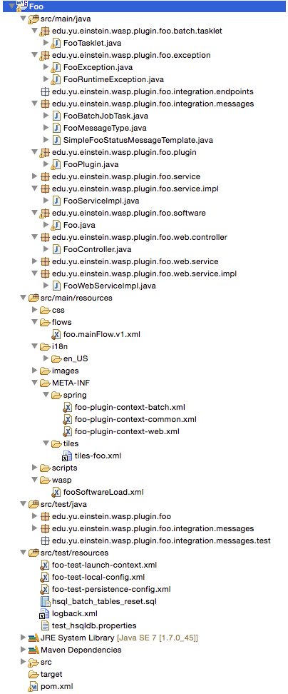
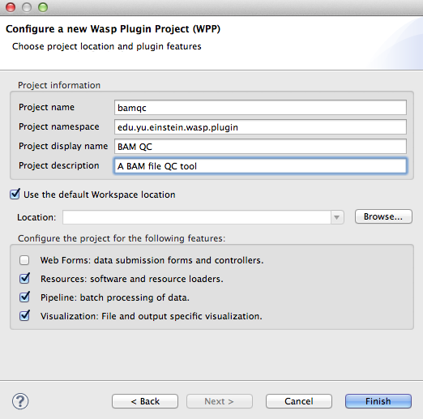

Creating a Wasp Plugin Project (WPP)
####################################

Wasp Plugin Projects (WPPs) are extensions of the Wasp System (WS) Core code which enable users to add new features to a local instance of the WS or for open-source 
distribution. WPPs can provide a variety of functionalities, common examples being:

* New assays: Sample submission form definitions and flow; analysis workflows.
* Software: definition; dependencies and workflows
* Visualization tools: Generation of panels for viewing data

This section demonstrates how to create working WPPs from scratch, walking the reader through the process step by step. We will first create a simple
plugin for the "Picard" suite of tools. `Picard <http://picard.sourceforge.net>`_ is a set of command line Java executables that manipulate SAM / BAM files. 
Next we will make a plugin for BAM file QC which depends on the BWA plugin to implement the *CollectAlignmentSummaryMetrics* tool).

So what is a WPP and individual plugin to The Wasp System? A WPP represents a project which is built into a single versioned jar. 
Each plugin within the WPP is defined by a bean implementing an extension of the ``wasp-core:edu.yu.einstein.wasp.plugin.WaspPlugin`` class. During bean 
ininitialization, a list of beans derived from this class are stored in a bean of type ``edu.yu.einstein.wasp.plugin.WaspPluginRegistry``. This bean can be
autowired into a POJO and asked to return a list of plugins that implement a specific subtype and/or which handle a particular 'area'. An area is simply a 
namespace used for identifying an area of fuctionality. Often it is synonymous with an internal name (iname) associated with a database entity, e.g. an assay 
workflow iname like 'chipseq'. The interfaces implemented by the plugin define its functionality and facilitate inter-component interaction.

Installing and Using the Wasp System Eclipse Plugin
***************************************************

In order to create a WPP for the Wasp System you first need to install the Wasp System Eclipse Plugin (WSEP) for the STS from the WSEP 
update site (http://waspsystem.org/eclipse):

1) From the STS menu choose *Help* -> *Install New Software* then in the dialog select *Add*.

2) Fill in the text boxes: *Name:* "Wasp System Update Site", *Location:* ``http://waspsystem.org/eclipse``. Click *OK*.

3) In the *Work with* section of the *Install* dialog, select *Wasp System Update Site*, press the *Select All* button then *Next* -> *Next*.

4) Agree to the license agreement and click *Finish*. You will see a security warning about installing unsigned content. This is nothing to worry about, 
   simply click *OK* to proceed.

5) When prompted, click the button to restart Eclipse.

Creating a New WPP using the Wasp System Eclipse Plugin Wizard
**************************************************************

From the STS menu bar select *File* -> *New* -> *Project* -> *WASP Plugin* -> *WASP Plugin Project* and click *Next*. Fill in the Project information 
as requested and configure the project by selecting the desire features (:num:`figure #fig-configureProj`):

.. _fig-configureProj:
 
.. figure:: figures/configureWaspProj.png 
   :width: 20cm
   :align: center
   
   Configuration of a new WPP.

* **Web forms:**
  Sets up the project to aid with producing a WPP that is web-enabled. Provides a folder structure, configuration files and classes necessary to interact
  with the *wasp-web* application. Check this option if providing a resource such as a DNA sequencer, an assay workflow, or software for primary analysis 
  where user parameter selection / configuration is possible.
	
* **Resource:**
  Checking this option adds files and folders that help with developing a WPP that provides a resource (particularly software).
	
* **Pipeline:**
  This option should be checked if the WPP is going to provide one or more Spring Batch Workflows. It ensures inclusion of necessary configuration files
  and a suitable folder structure.
	
* **Visualization:**
  If a WPP is designed to provide visualizations, e.g. present plots of data or a table of information, ensure that this item is checked.
	

After configuring the project click *finish* and the project will be built and appear in the *Package Explorer* on the left-hand side of the Eclipse IDE.

   
A Quick Look at Some Spring Framework Fundamentals
**************************************************

Before we look in detail at the structure of the foo project and examine the various components, we first need to understand some basic 
fundamentals of the Spring framework.

Spring facilitates the creation of 
powerful applications without worrying about the plumbing or writing boilerplate code. It is configuration-centric, creating an application context during 
application initialization which consists of Java beans which have been pre-configured either in code or XML files. By programming to interfaces, it is easy
to swap out components for testing or upgrading the application. For example, it is easy to change from using a mysql database to an Oracle database
simply by swapping out database adapters in configuration and without changing any business logic (POJOs). 

In the Wasp System, the configuration (XML) files defining the application contexts of the core components (*wasp-core*, *wasp-daemon* and *wasp-web*) import 
WPP-specific configuration files from each WPP. In the ``src/main/resources:META-INF/spring`` folder within the project structure we have 
created you will see XML configuration files suffixed by ``common.xml``, ``batch.xml`` and ``web.xml`` (the latter 
two are 
optional depending on how the WPP was configured). Looking in the foo project ``foo-plugin-context-common.xml`` file, a very simple bean is defined 
representing a string instance called *fooPluginArea* which has the value "foo" injected via the constructor (remember that an 'area' represents a namespace in 
The Wasp System):

.. code-block:: xml
 
   <bean id="fooPluginArea" class="java.lang.String">
       <constructor-arg>
           <value>foo</value>
       </constructor-arg>
   </bean>
	
The second bean in this file is declaring a configured instance of the ``edu.yu.einstein.wasp.plugin.foo.plugin.FooPlugin`` class:

.. code-block:: xml

   <bean id="foo" class="edu.yu.einstein.wasp.plugin.foo.plugin.FooPlugin">
       <constructor-arg name="iName" ref="fooPluginArea" />
       <constructor-arg name="waspSiteProperties" ref="waspSiteProperties" />
       <constructor-arg name="channel" ref="wasp.channel.plugin.foo" />
       <property name="description" value="A foo plugin" />
       <property name="provides" >
           <set>
             <ref bean="foo" /> 
           </set>
        </property>
        <property name="handles" >
            <set>
                <ref bean="fooPluginArea" />
            </set>
        </property>
   </bean>

Notice how the *fooPluginArea* bean is injected into the *foo* bean by providing its object reference as a constructor argument. Notice also how 
collections may be injected, in this case a collection of type ``java.util.Set``. You can see another example of passing by value with the setting of the 
*description*  property. Under the hood, spring does not directly set the value of *description*, instead it expects there to be a public method 
``void setDescription(String)`` defined in the ``FooPlugin`` class. Similarly, for the *provides* property, Spring expects the ``FooPlugin`` class to 
define a method ``void setProvides(Set<?>)``.

It is possible to evaluate expressions and inject the result into a bean during instantiation e.g.:

.. code-block:: java

   <bean class="org.baz.bar.MyClass">
       <property name="foobar">
           <value>${wasp.config.foobar}</value>
       </property>
       <property name="name" value="#{anotherBean.getName()}" />
   </bean>
	
In the above example two properties called *foobar* and *name* are being set. The *foobar* property value is intended to be an evaluated property. In the 
Wasp System, custom and system properties are both defined in the *wasp-config* WPP within the ``src/main/resources/\*.properties`` files. In this example,
one of these files is expected to contain the line ``wasp.config.foobar=My Foo Plugin``. Thus, during bean instantiation, the *${wasp.config.foobar}* placeholder
is replaced with the String value "My Foo Plugin". The *name* property value is obtained by evaluating a `Spring Expression Language (SpEL) 
<http://docs.spring.io/spring-framework/docs/3.2.x/spring-framework-reference/html/expressions.html>`_ construct. In this case, it assumes a bean called "anotherBean" 
is defined, and evaluates its ``getName()`` method.

An alternative to injecting constructor / property values in the XML bean definitions is to do it in the Class definition. An ``@Autowired`` annotation placed 
above a field, setter method or constructor 
signifies that Spring should locate and inject a bean of the correct type during initialization. Most of the time single instances of a particular class are
instantiated as beans, however, if there is more than one bean of a particular type, Spring need to know which one you wish to autowire. This is accomplished 
using the ``@Qualifier("theBeanIWant")`` annotation. It is also possible to inject property values using ``@Value``. These concepts are illustrated below:

.. code-block:: java
   
      
   Bar bar;
   
   // The '@Autowired' annotation tells Spring that we expect there to be a single bean 
   // (a dependency) of type Bar configured in the application context which should be 
   // injected on bean initialization. When testing the class we can set the value of bar 
   // explicitly, e.g. by providing a stub or mock object.
   @Autowired 
   void setBar(Bar bar){
     this.bar = bar;
   }
   
   // Qualifying here because the application context contains two beans of type Foo called 
   // 'foo' and 'fooey'. We need to tell Spring which one to use
   @Autowired
   @Qualifier("foo") 
   Foo foo;
   
   // Here we inject a value defined in a .properties file in the wasp-config WPP (see above). 
   // If no value is specified we provide a default value "not set" (this is optional).
   @Value("${wasp.config.foobar:not set}")
   String foobar;
   
   void setFoobar(String foobar){
     this.foobar = foobar;
   }
   
If a class is annotated to allow autowiring of dependencies and does not require any custom configuration, it is possible to have Spring load an instance
automatically without any XML definition. Simply add the ``@Component`` annotation above the class declaration (or a more appropriate derivative, e.g. 
``@Service`` for service classes) and the line ``<context:component-scan base-package="org.baz.bar.packageToScan" />`` in an appropriate configuration file within 
``src/main/resources:META-INF/spring`` (replacing "org.baz.bar.packageToScan" with the actual package enclosing any annotated class(es) to be loaded by Spring). 
On application initialization, Spring creates an instance of each component-scanned class, giving it a name identical to the simple name of the class with the
first letter de-capitalized.

.. important::

   You should be aware of the bean life-cycle. During application initialization: 
     
     1. Bean definitions are loaded.  
     2. Properties are evaluated.
     3. Dependencies are injected.
     4. Beans are post processed. Normally, when instantiating a class, work can be performed in a constructor using values provided. However, when using values
        injected into beans, they are not available immediately after construction. Such work should, instead, be performed in a public method annotated with 
        ``@PostConstruct``. All injected values will be available for use when such an annotated method is executed by Spring. If any cleanup is required prior 
        to bean destruction, e.g. closing a resource, a public method annotated with ``@PreDestroy`` may also be provided.
     5. Beans ready for use. 

With a basic introduction to the concepts of Spring required to generate WPPs, we can move on to examine the details of the project structure for a WPP:

.. _fig-exampleProjStructure:

   
   Example project folder structure for a project called Foo created with all configuration options checked.

* **src/main/java**

  **<package_root>.batch.tasklet** 
    Location for batch job tasklets. Tasklets contain the code executed in each step of the batch flow. They extend abstract class 
    ``wasp-daemon:edu.yu.einstein.wasp.daemon.batch.tasklets.WaspTasklet``. The example below is taken from the Babraham plugin's ``TrimGaloreTrimming`` tasklet:
    
    .. code-block:: java

       // extend WaspRemotingTasklet which is designed to handle waiting for cluster jobs to finish
       public class TrimGaloreTrimmingTasklet extends WaspRemotingTasklet {

       private String software;
       private int cellLibraryId;
       private int fileGroupId;
       private int fileNumber;
       private int readSegments;
       private int runId;

       @Autowired
       private SampleService sampleService;

       @Autowired
       private AdaptorService adaptorService;

       @Autowired
       @Qualifier("trim_galore")
       private TrimGalore trimGalore; // thr TrimGalore software object

       @Autowired
       private GridHostResolver hostResolver; // we need this in order to execute a WorkUnit

       public TrimGaloreTrimmingTasklet(String softwareName, int runId, int cellLibraryId, int fileGroupId, int fileNumber, int readSegments) {
           this.software = softwareName;
           this.runId = runId;
           this.cellLibraryId = cellLibraryId;
           this.fileGroupId = fileGroupId;
           this.fileNumber = fileNumber;
           this.readSegments = readSegments;
       }

       /*
        * Business logic necessary to prepare and execute a grid job
        * Uncomment the @Retryable annotation to restart the tasklet in the event of failure.
        * It is possible to set the number of retry attempt and backoff time in the 
        * wasp-config: wasp.site.properties file e.g.:
        * # setting applicable to the @Retryable annotation
        * wasp.batch.retryBasic.fixed.maxattempts=3
        * wasp.batch.retryBasic.fixed.interval=5000
        */
       @Override
       // @Retryable
       @Transactional("entityManager")
       public void doExecute(ChunkContext context) throws Exception {
           SampleSource cellLibrary = sampleService.getCellLibraryBySampleSourceId(cellLibraryId);
           Sample library = sampleService.getLibrary(cellLibrary);
           TrimGaloreParameters params = new TrimGaloreParameters();
           String adapter = adaptorService.getAdaptor(library).getSequence();
           if (adapter.length() > 13)
               adapter = adapter.substring(0, 13);
           params.setAdapter(adapter);
           if (readSegments > 1)
               params.setAdapter2(adapter);
           WorkUnit w = trimGalore.getTrimCommand(params, software, runId, cellLibraryId, fileGroupId, fileNumber);
           GridResult result = hostResolver.execute(w);
           logger.debug("submitted trim step, going for hibernation");
           saveGridResult(context, result);
       }
       
       @Override
       @Transactional("entityManager")
       public void doPreFinish(ChunkContext context) throws Exception{
           // put any business logic in here to execute immediately after successful completion of the WorkUnit 
           // execution that was submitted from the doExecute() method but before completion of the execution block. 
           // This code is not called if an exception was thrown by the execution block
       }
       
       @Override
       public void beforeStep(StepExecution stepExecution) {
           // code to prepare for tasklet execution goes here. Also cleanup code in case of restart.
           super.beforeStep(stepExecution);
       }
    
       @Override
       public ExitStatus afterStep(StepExecution stepExecution) {
           // This block is called before exiting the step even if the step failed (an exception was thrown from the execution block). 
           // It is possible to modify the exit status code and message here.
           return super.afterStep(stepExecution);
       }
       
    
  **<package_root>.batch.controller**
    MVC controller code. For web-enabled WPPs the request mappings and associated business logic are defined here. Classes should extend the 
    ``wasp-web:edu.yu.einstein.wasp.controller/WaspController`` class.
    
  **<package_root>.exception**
    Package for placing WPP-specific exceptions. An extension of Exception and RuntimeException are provided and can be extended further.
    
  **<package_root>.integration.endpoints**
    This package is where custom Spring Integration message endpoint classes can be defined. These include service activators, channel adapters, transformers, 
    filters, routers, splitters and aggregators. See the `SpringSource documentation <http://docs.spring.io/spring-integration/docs/4.0.3.RELEASE/reference/html/>`_ 
    for more information message endpoints.
  
  **<package_root>.integration.messages**
    Spring Integration provides for messages and message channels to be defined that allow communication between the core wasp systems and WPPs. Messages 
    are simply a set of 
    headers (key-value) and a payload object. The name and value of headers and the type and value of the payload can all be used to determine how a message 
    is routed, filtered and acted upon. As the specification is so loose, the Wasp System uses wrappers around the messages to allow standardization. This
    package may contain message template classes that extend the ``wasp-core:edu.yu.einstein.wasp.integration.messages.templates.WaspMessageTemplate`` and 
    ``wasp-core:edu.yu.einstein.wasp.integration.messages.templates.WaspStatusMessageTemplate`` classes. Extensions of the 
    ``wasp-core:edu.yu.einstein.wasp.integration.messages.WaspMessageType`` and ``WaspStatus`` classes may also be provided here. The base classes for 
    ``WaspMessageType`` and ``WaspStatus`` are shown below:
    
    .. code-block:: java
    
       public class WaspMessageType {
         public static final String HEADER_KEY = "messagetype"; // header name
         public static final String JOB = "job"; 
         public static final String PLUGIN = "plugin";
         public static final String RUN = "run";
         public static final String SAMPLE = "sample";
         public static final String LIBRARY = "library";
         public static final String ANALYSIS = "analysis";
         public static final String GENERIC = "generic";
         public static final String FILE = "file";
         public static final String LAUNCH_BATCH_JOB = "launchBatchJob";
       }
		
       public class WaspJobParameters {
         public static final String GENOME_STRING = "genomeString";
         public static final String JOB_ID = "jobId";
         public static final String JOB_NAME = "jobName";
         public static final String SAMPLE_ID = "sampleId";
         public static final String SAMPLE_NAME = "sampleName";
         public static final String LIBRARY_ID = "sampleId";
         public static final String LIBRARY_NAME = "libraryName";
         public static final String CELL_LIBRARY_ID = "cellLibraryId";
         public static final String RUN_ID = "runId";
         public static final String RUN_NAME = "runName";
         public static final String RUN_RESOURCE_CATEGORY_INAME = "runResourceCatIname";
         public static final String PLATFORM_UNIT_ID = "platformUnitId";
         public static final String PLATFORM_UNIT_NAME = "platformUnitName";
         public static final String BATCH_JOB_TASK = "batchJobTask";
         public static final String FILE_GROUP_ID = "fileGroupId";
         public static final String TEST_ID = "testId";
       }
  
  **<package_root>.plugin**
    This is the location of plugin definition classes. For each plugin in the project, a bean derived from type 
    ``wasp-core:edu.yu.einstein.wasp.plugin.WaspPlugin`` is defined in the 
    configuration for the WPP which is located in the ``src/main/resources:META-INF/spring/`` folder. Optionally, the plugin may declare properties "provides" 
    and "handles" which declare services that the plugin implements and resources that it may act upon.  For example, a plugin may declare that it implements
    "referenceBasedAligner", or "illuminaSequenceRunProcessor". An illuminaSequenceRunProcessor might additionally handle "illuminaHiSeq2000Area". 
    For example, the *Babraham* WPP contains three plugins each 
    representing wrappers around three software applications provided by Babraham Bioinformatics: FastQC, FastQ Screen and Trim Galore, e.g. for Trim Galore:
        
    .. code-block:: java
    
 
       public class TrimGalorePlugin extends WaspPlugin implements ClientMessageI, FileDataTabViewing {

         protected final Logger logger = LoggerFactory.getLogger(getClass());
    
         public static final String TRIM_GALORE_PLOT_KEY = "size-plot";

         @Autowired
         BabrahamService babrahamService;
    
         @Autowired
         protected RunService runService;

         protected WaspJobExplorer batchJobExplorer;

         @Autowired
         void setJobExplorer(JobExplorer jobExplorer) {
           this.batchJobExplorer = (WaspJobExplorer) jobExplorer;
         }

         @Autowired
         @Qualifier("trim_galore")
         private Software trim_galore;

         public TrimGalorePlugin(String iName, Properties waspSiteProperties, MessageChannel channel) {
           super(iName, waspSiteProperties, channel);
         }

         /**
          * {@inheritDoc}
          */
         @Override
           public Hyperlink getDescriptionPageHyperlink() {
           return new Hyperlink("trimgalore.hyperlink.label", "/babraham/trimgalore/description.do");
         }

         /**
          * Trimming is happening prior to returning the file to the user,
          * so the status of analysis of a fastq file is always complete
          * when the user wants to visualize any information.
          * {@inheritDoc}
          */
         @Override
         public Status getStatus(FileGroup fileGroup) {
           Map<String, Set<String>> parameterMap = new HashMap<String, Set<String>>();
           Run run = babrahamService.getRunForFileGroup(fileGroup);
           if (run == null){
              logger.warn("Unable to determine status as failed to obtain a run for filegroup with id = " 
                     + fileGroup.getId());
              return Status.UNKNOWN;
           }
           Set<String> runIdStringSet = new LinkedHashSet<String>();
           runIdStringSet.add(run.getId().toString());
           parameterMap.put(WaspJobParameters.RUN_ID, runIdStringSet);
           try{
              if (!getViewPanelTab(fileGroup).getPanels().isEmpty())
                  return Status.COMPLETED;
           } catch (PanelException e){}
      
           JobExecution je = batchJobExplorer.getMostRecentlyStartedJobExecutionInList(batchJobExplorer
                  .getJobExecutions(TrimGalore.FLOW_NAME, parameterMap, false));
           if (je == null){
              logger.info("No TrimGalore batch jobs found for FileGroup id=" + fileGroup.getId());
              return Status.UNKNOWN;
           }
           ExitStatus jobExitStatus = je.getExitStatus();
           if (jobExitStatus.isFailed())
              return Status.FAILED; 
           if (jobExitStatus.isRunning())
              return Status.STARTED; // trumps previously set status of COMPLETED
           return Status.UNKNOWN;
         }

         /**
          * get view data to display
          */
         @Override
         public PanelTab getViewPanelTab(FileGroup fileGroup) throws PanelException {
           return ((BabrahamWebServiceImpl) babrahamService).getTrimGaloreDataToDisplay(fileGroup.getId());
         }
    
    
         /**
          * Method called from the CLI. Message payload is a run id
          */
         public Message<String> trim(Message<String> m) {
           if (m.getPayload() == null || m.getHeaders().containsKey("help") || m.getPayload().toString().equals("help"))
              return trimHelp();
      
           Map<String, String> jobParameters = new HashMap<String, String>();
      
           logger.info("launching TrimGalore flow");
      
           try {
              Integer id = getIDFromMessage(m);
              if (id == null)
                  return MessageBuilder.withPayload("Unable to determine run id from message: " 
                        + m.getPayload().toString()).build();
          
              jobParameters.put(WaspJobParameters.RUN_ID, id.toString());
              jobParameters.put(WaspJobParameters.BEAN_NAME, "casava");
              // the next line overcomes limitation of job being run only once
              jobParameters.put("uniqCode", Long.toString(Calendar.getInstance().getTimeInMillis())); 
              logger.info("Sending launch message to flow '" + TrimGalore.FLOW_NAME + "' on run with id=" + id);
              runService.launchBatchJob(TrimGalore.FLOW_NAME, jobParameters);
          
              return (Message<String>) MessageBuilder
                        .withPayload("Initiating TrimGalore flow on run with id=" + id).build();
           } catch (WaspMessageBuildingException e1) {
              logger.warn("unable to build message around jobParameters: " + jobParameters.toString());
              return MessageBuilder.withPayload("Unable to launch TrimGalore").build();
           }
      
         }
   
         /**
          * Method called from the CLI to display help
          */
         private Message<String> trimHelp() {
           String mstr = "\nBabraham Trim Galore plugin: launch the trim flow with given run Id.\n" +
                 "wasp -T trim_galore -t trim -m \'{id:\"1\"}\'\n";
           return MessageBuilder.withPayload(mstr).build();
         }
   
         /**
          * parse json from message payload to extract run id
          */
         private Integer getIDFromMessage(Message<String> m) {
           Integer id = null;
      
           JSONObject jo;
           try {
              jo = new JSONObject(m.getPayload().toString());
              if (jo.has("id")) {
                  id = new Integer(jo.get("id").toString());
              } 
           } catch (JSONException e) {
              logger.warn("unable to parse JSON");
           }
           return id;
         }
       }
       
    This Plugin implements the FileTabViewing interface and so implements the ``getViewPanelTab(FileGroup fileGroup)`` method. 
    The ``PanelTab`` object returned is displayed in a web browser as shown in figure :num:`figure #fig-trimGalorePanelTab`:

    .. _fig-trimGalorePanelTab:
 
    .. figure:: figures/trimGalorePanelTab.png 
       :width: 20cm
       :align: center
   
       PanelTab displayed in a web browser view
       
    .. note::
    
       Any class derived from ``WaspPlugin`` is registered in a bean of type ``wasp-core:edu.yu.einstein.wasp.plugin.WaspPluginRegistry`` which 
       can be autowired into any class and interrogated using the ``Set<WaspPlugin> getPluginsHandlingArea(String area)`` and 
       ``List<T> getPluginsHandlingArea(String area, Class<T> clazz)`` methods.
  

  **<package_root>.service.impl**
    WPP business logic that accesses data access objects (DAOs) defined in the wasp-core can be implemented here. Any classes defined in here with 
    annotations ``@Service`` or ``@Component`` will be automatically instantiated as beans on application startup.
  
  **<package_root>.software**
    This package is intended for inclusion of Classes extending the ``wasp-core:edu.yu.einstein.wasp.software.SoftwarePackage`` class. Each class defined in
    this package should provide methods relevant for executing the software it is wrapping. A loader configuration file (filename ending in ``Load.xml``) should 
    be provided in the ``src/main/resources:wasp/`` folder which creates a bean instance of each software class via the 
    ``edu.yu.einstein.wasp.load.SoftwareLoaderAndFactory`` factory bean. This is pre-configured for you when you created the project. The bean is generated via 
    a "factory bean" because certain attributes must be stored in the core database. For trim galore a cut down version of the Software class is shown below along 
    with the accompanying XML configuration:
    
    .. code-block:: java
    
       @Transactional("entityManager")
       public class TrimGalore extends SoftwarePackage {
           public static final String MANY_FLOW_NAME = "babraham.trim_galore.fileTrim";
           public static final String FLOW_NAME = "babraham.trim_galore.mainFlow";
           public static final String MANY_REGISTRATION_NAME = "babraham.trim_galore.register";

           public TrimGalore() {
               setSoftwareVersion("0.3.3"); // this default may be overridden in
                                            // wasp.site.properties
               }

           public String getTrimCommand(TrimGaloreParameters params, String softwareName, int runId, int cellLibraryId, int fileGroupId, int firstFile)
                throws Exception {      
                // code to configure and return a bash command for trimming a fastq file to be executed from a configured WorkUnit
           }

           public String getRegisterTrimmedCommand(int runId, int cellLibraryId, String softwareName) throws Exception {
               // code to configure and return a bash command for registering a trimmed fastq file
           }
    
 
           /**
            * Given a GridResult (used for host and working dir info) and a file group id, this method 
            * will return a DataSeries representation of the total number of reads and the trimming result 
            * summary statistics.
            */
           public JSONObject parseOutput(GridResult result, FileGroup fileGroup) throws Exception {
             // code to obtain a json representation of trimmed summary data
           }

       }
    
    .. code-block:: xml
    
       <bean id="trim_galore" class="edu.yu.einstein.wasp.load.SoftwareLoaderAndFactory">
           <property name="type"><value type="java.lang.Class">edu.yu.einstein.wasp.plugin.babraham.software.TrimGalore</value></property>
           <property name="name" value="Trim Galore" />
           <property name="description" value="A quality and adapter sequence FASTQ trimming tool." />
           <property name="area" ref="trimGaloreArea" />
           <property name="resourceType" ref="fastqProcessorResourceType" />
       </bean> 
  
* **src/main/resources**

  **css** 
    project specific .css files go here
  
  **flows**
    Spring batch flows should be place in here. All files within this folder (or subdirectories of this folder) are imported by the *wasp-daemon* commonent of
    the Wasp System during application initialization.
    
  **i18n**
    Internationalization properties files go here. Typically internalization properties defined within here may be evaluated in code by injecting the 
    ``messageServiceImpl`` bean (implements ``edu.yu.einstein.wasp.service.MessageService``) e.g for a property in the ``messages_en_US.properties`` file defined
    ``foo.warning=Do not mess with foo``, in the following example the method ``getInternationalizedFooWarning()`` returns the string "Do not mess with foo".
    
    .. code-block:: java
    
      @Autowired
      private MessageService messageService;
	
      String getdefaultInternationalizedFooWarning(){
        return messageService.getMessage("foo.warning"); // defaults to Locale.US
      }
      
      String getInternationalizedFooWarning(){
        return messageService.getMessage("foo.warning", Locale.US); // specify Locale directly
      }
    
    Also in web views, these properties may be evaluated within jsp pages. In the example shown below the text "Foo says: Do not mess with foo" would 
    be displayed in the browser:
    
    .. code-block:: jsp
    
      <%@ taglib prefix="fmt" uri="http://java.sun.com/jsp/jstl/fmt" %>
      
      <%-- gets locale automatically from HttpServletRequest --%>
      Foo says: <fmt:message key="foo.warning" />  

  **images**
    Images for display in the view may be placed here.
    
  **META-INF**
    **/spring**
      WPP-specific XML configuration files to be imported into the application context of wasp system applications:
      
      * **\*-plugin-context-batch.xml**
          Imported into the *wasp-daemon* application context: intended for definition of beans used with Spring Batch workflows.
      * **\*-plugin-context-web.xml**
          Imported into the *wasp-web* application context: indended for definition of beans to be used within *wasp-web*
          
     **/tiles** 
       In here are defined Spring MVC Tiles configurations in files with the name pattern "tiles-\*.xml"
   
   **/scripts**
     Location for javascript libraries
   
   **/wasp**
     Location for XML files declaring beans for loading resources. Beans declared in here will be imported into all wasp System applications. Implementations
     of classes in the ``edu.yu.einstein.wasp.load`` package may be defined here. Currently the list comprises the following classes:
     
     * AdaptorsetLoaderAndFactory
     * FileTypeLoaderAndFactory
     * ResourceCategoryLoaderAndFactory
     * ResourceTypeLoaderAndFactory
     * SampleSubtypeLoaderAndFactory
     * SampleTypeCategoryLoaderAndFactory
     * SampleTypeLoaderAndFactory
     * SoftwareLoaderAndFactory
     * WaspLoader
     * WaspResourceLoader
     * WorkflowLoaderAndFactory
     
* **src/test/java**
    location of TestNG test classes. Some examples are provided to help get you going (see note below)
    
* **src/test/resources**
    location of test resources including test database files, test contexts, test flows etc.
    
  
Developing the Picard WPP
*************************

Before we start lets consider
what we would like the plugin to do. Remember that Picard is a collection of discrete java command line applications. Some are file processing tools whilst 
others provide statistical summaries for BAM files. We wish to declare a Software bean for Picard so that wasp is able to load information about it
from configuration and enable it to be injected as a dependency for an units of work (see ``WorkUnit`` class) that wish to use Picard tools. To create the
picard plugin, generate a new Wasp Eclipse Plugin Project with only the 'Resources' feature is chosen:

.. _fig-configurePicardProj:

There is actually no changes that need to be made to this project. We simply need to register some properties in the *wasp-config* project 
``src/main/resources/wasp.site.properties`` to allow the *GridHostResolver* to be able to load the Picard software module when a dependency to Picard is 
declared (we will see how this is achieved in practise when developing the BamQC plugin). So we simply open the 
``wasp-config:src/main/resources/wasp.site.properties`` file and add the following:

.. code-block:: text

   #assumes a host called 'myhost' has been defined. We use this as a prefix.
   #picard
   myhost.software.picard.name=picard
   myhost.software.picard.version=1.96
   myhost.software.picard.availableversions=1.96
   
Under the hood, when a WorkUnit declares a dependency of *Picard*, the SoftwareManager places bash code in the execution script to set a bash variable 
``$PICARD_ROOT`` which points to the location of the Picard jars. If using the ModulesManager implementation of SoftwareManager, this is achieved by running: 

   ``module load picard/1.96``

Developing the BamQC WPP
************************

Remember this plugin is designed to run Picard's ``CollectAlignmentSummaryMetrics`` on a BAM file on notification of its creation. The output file will then be 
parsed and the data displayed in a user-friendly manner when a user is examining data associated with the BAM file.

First we need to create the WPP in the usual way. This time selecting the *Pipeline* and *Visualization* features:

.. _fig-configureBamQcProj:

Running Picard's ``CollectAlignmentSummaryMetrics`` at the Linux Command Line
=============================================================================

Lets first take a look at the command we wish to execute and the output we obtain. Assume we have an environment variable ``$PICARD_ROOT`` which points to the 
location of the Picard jars (see previous section):

.. code-block:: bash

   $ java -Xmx2g -jar $PICARD_ROOT/CollectAlignmentSummaryMetrics.jar INPUT=in.bam OUTPUT=in_bam_metrics.txt
   
After execution is complete, the contents of in_bam_metrics.txt look something like this:

.. code-block:: text

   ## net.sf.picard.metrics.StringHeader
   # net.sf.picard.analysis.CollectAlignmentSummaryMetrics INPUT=in.bam OUTPUT=in_bam_metrics.txt VALIDATION_STRINGENCY=SILENT    
   MAX_INSERT_SIZE=100000 ADAPTER_SEQUENCE=[AATGATACGGCGACCACCGAGATCTACACTCTTTCCCTACACGACGCTCTTCCGATCT, 
   AGATCGGAAGAGCTCGTATGCCGTCTTCTGCTTG, AATGATACGGCGACCACCGAGATCTACACTCTTTCCCTACACGACGCTCTTCCGATCT, 
   AGATCGGAAGAGCGGTTCAGCAGGAATGCCGAGACCGATCTCGTATGCCGTCTTCTGCTTG, AATGATACGGCGACCACCGAGATCTACACTCTTTCCCTACACGACGCTCTTCCGATCT, 
   AGATCGGAAGAGCACACGTCTGAACTCCAGTCACNNNNNNNNATCTCGTATGCCGTCTTCTGCTTG] METRIC_ACCUMULATION_LEVEL=[ALL_READS] IS_BISULFITE_SEQUENCED=false ASSUME_SORTED=true 
   STOP_AFTER=0 VERBOSITY=INFO QUIET=false COMPRESSION_LEVEL=5 MAX_RECORDS_IN_RAM=500000 CREATE_INDEX=false CREATE_MD5_FILE=false
   ## net.sf.picard.metrics.StringHeader
   # Started on: Thu Sep 12 15:05:03 EDT 2013

   ## METRICS CLASS	net.sf.picard.analysis.AlignmentSummaryMetrics
   CATEGORY	TOTAL_READS	PF_READS	PCT_PF_READS	PF_NOISE_READS	PF_READS_ALIGNED	PCT_PF_READS_ALIGNED	PF_ALIGNED_BASES	
   PF_HQ_ALIGNED_READS	PF_HQ_ALIGNED_BASES	PF_HQ_ALIGNED_Q20_BASES	PF_HQ_MEDIAN_MISMATCHES	PF_MISMATCH_RATE	PF_HQ_ERROR_RATE	PF_INDEL_RATE	
   MEAN_READ_LENGTH	READS_ALIGNED_IN_PAIRS	PCT_READS_ALIGNED_IN_PAIRS	BAD_CYCLES	STRAND_BALANCE	PCT_CHIMERAS	PCT_ADAPTER	SAMPLE	LIBRARY	READ_GROUP
   UNPAIRED	36922937	36922937	1	452	0	0	0	0	0	0	0	0	0	0	101	0	0	0	00.002885	

Running Picard's ``CollectAlignmentSummaryMetrics`` in the BamQC Plugin
======================================================================== 
     
Lets assume we have registerd a bam file in the Wasp System database. We will access the location of the bam file via its FileGroup object. Every file 
(FileHandle object) registered in the system is a member of a FileGroup object, even if there is a one-to-one mapping between fileGroup and fileHandle. Once we 
have access to the file we need to define the work somewhere. In the Wasp System we configure a WorkUnit instance to handle command line operations. The 
WorkUnit is a high-level wrapper over the underlying server architecture. It permits specification of a list of commands to execute, requesting of 
resources (cpu slots, memory etc) and definition of environment variables.

The first stage is implementation is to edit the pre-generated ``BamqcPlugin`` class in the ``edu.yu.einstein.wasp.plugin.bamqc.plugin`` package. The work 
performed by this Software object is encapsulated in three methods, 
``WorkUnit getWorkUnit(Integer fileGroupId)`` to get a configured WorkUnit instance to run the command, ``String getCommand()`` to get the bash-ready command 
to execute in the WorkUnit and ``parseOutput(String resultsDir)`` to parse the output to a JSON representation which can be stored in the database. 

So our Bamqc class should now look like:

.. code-block:: java

   package edu.yu.einstein.wasp.plugin.picard.software;
   import java.util.ArrayList;
   import java.util.List;

   import org.json.JSONException;
   import org.json.JSONObject;
   import org.springframework.beans.factory.annotation.Autowired;

   import edu.yu.einstein.wasp.exception.DataParseException;
   import edu.yu.einstein.wasp.exception.GridException;
   import edu.yu.einstein.wasp.grid.work.WorkUnit;
   import edu.yu.einstein.wasp.grid.work.WorkUnit.ExecutionMode;
   import edu.yu.einstein.wasp.grid.work.WorkUnit.ProcessMode;
   import edu.yu.einstein.wasp.model.FileGroup;
   import edu.yu.einstein.wasp.model.FileHandle;
   import edu.yu.einstein.wasp.plugin.picard.service.PicardService;
   import edu.yu.einstein.wasp.service.FileService;
   import edu.yu.einstein.wasp.software.SoftwarePackage;

   public abstract class Picard extends SoftwarePackage{

      private static final long serialVersionUID = -2632888941035900707L;

      @Autowired
      protected PicardService  picardService;
	
      @Autowired
      protected FileService fileService;
	
      public Picard() {
         setSoftwareVersion("1.96"); // This default may be overridden in wasp.site.properties
      }
	
     /**
      * Takes a FileGroup and returns a configured WorkUnit to run a Picard tool on the file group.
      * @param fileGroupId
      * @return Configured WorkUnit instance
      */
      public WorkUnit getWorkUnit(Integer fileGroupId) {
		
         WorkUnit w = new WorkUnit();
		
         // Require Picard. 
         // The GridHostResolver can use software dependencies to choose appropriate resources on which 
         // to execute a WorkUnit instance.
         List<SoftwarePackage> software = new ArrayList<SoftwarePackage>();
         software.add(this);
         w.setSoftwareDependencies(software);
		
         // require 3GB memory
         w.setMemoryRequirements(3);
		
         // require a single thread, execution mode PROCESS
         // indicates this is a vanilla execution.
         w.setProcessMode(ProcessMode.SINGLE);
         w.setMode(ExecutionMode.PROCESS);
		
         // set working directory to scratch
         w.setWorkingDirectory(WorkUnit.SCRATCH_DIR_PLACEHOLDER);
		
         // we aren't actually going to retain any files, so we will set the output
         // directory to the scratch directory.  Also set "secure results" to
         // false to indicate that we don't care about the output.
         w.setResultsDirectory(WorkUnit.SCRATCH_DIR_PLACEHOLDER);
         w.setSecureResults(false);
		
         // add the files to the work unit
         // files will be represented as bash variables in the work unit 
         FileGroup fileGroup = fileService.getFileGroupById(fileGroupId);
         List<FileHandle> files = new ArrayList<FileHandle>(fileGroup.getFileHandles());
         w.setRequiredFiles(files);
		
         // set the command
         w.setCommand(getCommand());
		
         return w;
      }
	
     /**
      * Set the command. Assume $PICARD_ROOT is set in configuration
      * WorkUnit sets up paths to data for registered 'requiredFiles'. The ${WASPFILE[0]} variable in the command
      * provides access to the first file in the list (in this case we only expect one file). 
      * @return String representing bash command
      */
      public abstract String getCommand();
	
     /**
      * This method takes a grid result of a successfully run Picard job, gets the working directory
      * and uses it to parse the output file into a JSONObject representing the data.  
      * @param resultsDir
      * @return JSONObject representation of the parsed data
      * @throws GridException
      * @throws DataParseException
      * @throws JSONException 
      */
      public abstract JSONObject parseOutput(String resultsDir) throws GridException, DataParseException, JSONException;
   }
   
Our implementation defines the ``String getCommand()`` and ``WorkUnit getWorkUnit(Integer fileGroupId)`` implementations, the latter of which defers the 
processing to a PicardService instance:

.. code-block:: java

   package edu.yu.einstein.wasp.plugin.picard.software;

   import org.json.JSONException;
   import org.json.JSONObject;

   import edu.yu.einstein.wasp.exception.DataParseException;
   import edu.yu.einstein.wasp.exception.GridException;
   import edu.yu.einstein.wasp.grid.work.WorkUnit;

   public class CollectAlignmentSummaryMetrics extends Picard {

      private static final long serialVersionUID = 3681418132863339589L;
	
      private static final String COLLECT_ALIGNMENT_SUMMARY_METRICS_OUTPUT = "collectAlignmentSummaryMetrics.out";
	
      public CollectAlignmentSummaryMetrics() {
         super();
      }
	
     /**
      * {@inheritDoc}
      */
      @Override
      public String getCommand() {
         String command = "java -Xmx2g -jar $PICARD_ROOT/CollectAlignmentSummaryMetrics.jar INPUT=${" 
         		+ WorkUnit.INPUT_FILE + "[0]} OUTPUT=" + COLLECT_ALIGNMENT_SUMMARY_METRICS_OUTPUT + "\n";
         return command;
      }
	
     /**
      * {@inheritDoc}
      */
      public JSONObject parseOutput(String resultsDir) throws GridException, DataParseException, JSONException {
         JSONObject outputJson = picardService.parseCollectAlignmentSummaryMetricsOutput(resultsDir);
         return outputJson;
      }

   }

   

